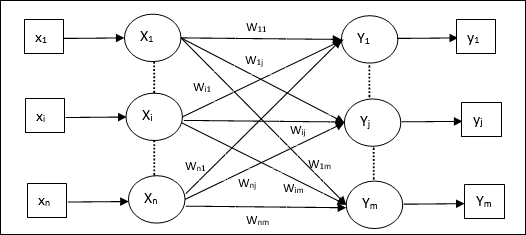

# YukihiroWatanabe.github.io
Visual explanations of Associatron-based associative memory, with diagrams, equations, and code.

# Visual Explanations of Associatron

This site provides visual, step-by-step explanations of
Associatron-based associative memory models,
with diagrams, equations, and code.

## What is Associatron?

Associatron is an early associative memory model
developed in Japan, focusing on pattern association.

*Figure © C-side Laboratory, Yatsugatake / Yukihiro Watanabe (CC BY 4.0)*

## Historical Note
- [The True Origin of the Hopfield Network: Nakano (1972) vs Hopfield (1982)](nakano-vs-hopfield.md)

## How to read this site
- Each page builds concepts visually
- Diagrams are placed between explanations
- Mathematical expressions are kept minimal and intuitive

## License
This work is licensed under a Creative Commons Attribution 4.0 International License (CC BY 4.0).
© C-side Laboratory, Yatsugatake  
© Yukihiro Watanabe
